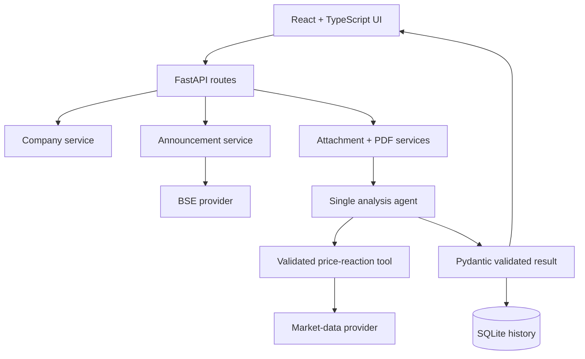
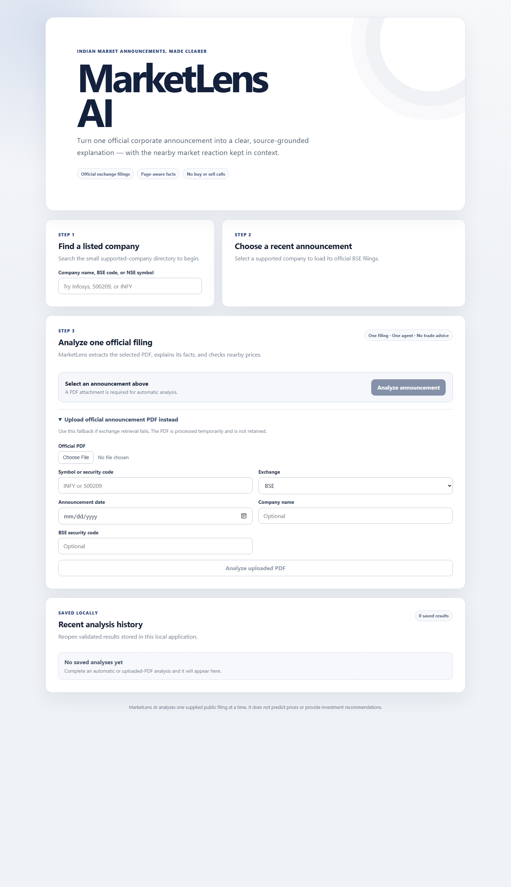

# MarketLens AI

MarketLens AI is a single-agent educational application that retrieves official
Indian stock-market corporate announcements, explains one selected filing, checks
the nearby price reaction, and saves the validated result locally.

> This is an educational explanation of public information, not investment advice.

**Build status:** all 12 documented phases (Phase 0 through Phase 11) are implemented.

## 1. Problem

Indian listed companies publish material announcements through exchange portals,
but a student or first-time reader must still resolve the company, locate the
right filing, open a dense PDF, identify important facts, and separately inspect
nearby prices. Generic chat interfaces also make source identity, arithmetic, and
document prompt injection difficult to control.

## 2. Solution

MarketLens turns that workflow into three explicit steps:

1. Search and select a supported company.
2. Select one recent official BSE announcement.
3. Analyze its attachment and display a structured, source-attributed explanation.

If automatic retrieval fails, the same backend accepts a manually uploaded
official BSE/NSE PDF. Both paths use the same extraction, validation, price, and
persistence rules.

## 3. Why one agent

Only interpretation benefits from a model. Company resolution, provider requests,
attachment security, PDF extraction, market lookup, arithmetic, and SQLite writes
are deterministic services. One bounded agent receives their normalized output,
may call only `get_price_reaction`, and returns one strict result.

This is easier to test and explain than a multi-agent design and avoids inventing
agent roles for ordinary application code.

## 4. Automatic retrieval workflow

```text
Search query
    -> local company resolution
    -> bounded BSE announcement request
    -> explicit announcement selection
    -> server-side attachment URL resolution
    -> secure temporary download
    -> page-aware PDF extraction
    -> single structured analysis agent
    -> deterministic nearby-price calculation
    -> validated response + SQLite history
```

The browser never provides an arbitrary attachment URL. Official detail and PDF
URLs are retained for attribution.

## 5. Manual-upload fallback

The fallback accepts a PDF plus symbol/security code, exchange, announcement date,
and optional company metadata. It enforces the same size, signature, page, scanned
PDF, prompt-injection, analysis, and cleanup controls. Uploaded bytes and extracted
pages are not stored in history.

For a setup-only synthetic fixture, see [sample-data/README.md](sample-data/README.md).

## 6. Architecture



The repository is a frontend/backend monorepo. Provider-specific behavior stays
under `backend/app/providers/`; normalized schemas isolate the API and UI from
exchange response formats.

## 7. Provider interfaces

Announcement providers implement bounded company search, announcement listing,
and attachment resolution:

```python
class AnnouncementProvider(Protocol):
    async def search_companies(self, query: str, limit: int = 10) -> list[CompanyMatch]: ...
    async def get_recent_announcements(
        self, company_id: str, from_date: date | None, to_date: date | None, limit: int = 20
    ) -> list[AnnouncementSummary]: ...
    async def download_attachment(self, announcement_id: str) -> DownloadedAttachment: ...
```

Market providers expose only bounded daily closes. Ticker resolution and reaction
arithmetic remain in application code, so yfinance is replaceable.

## 8. Tool-calling workflow

1. The backend supplies normalized metadata, page-aware text, warnings, and date.
2. Document text is marked as untrusted evidence.
3. The model may request `get_price_reaction` once.
4. Tool arguments must exactly match authoritative symbol/code, exchange, and date.
5. Application code calculates `((next_close - previous_close) / previous_close) * 100`.
6. The final JSON is validated; source and price fields are replaced with authoritative values.
7. Recommendation language is rejected before the result is returned or saved.

Reasoning output is neither exposed nor persisted.

## 9. Technology stack

| Layer | Technology |
| --- | --- |
| Frontend | React 19, Vite, strict TypeScript, TanStack Query, CSS |
| Backend | Python 3.12+, FastAPI, Pydantic, httpx |
| Documents | PyMuPDF |
| Analysis | OpenAI Responses API with strict structured output and function calling |
| Market prototype | pandas and replaceable yfinance adapter |
| Persistence | SQLAlchemy 2 + SQLite |
| Quality | pytest, Ruff, ESLint, TypeScript compiler, offline evaluation harness |

No LangChain, LangGraph, browser automation, vector database, Redis, Celery,
microservices, or container orchestration is used.

## 10. Local setup

Prerequisites:

- Python 3.12 or newer
- Node.js 20.19 or newer
- npm 10 or newer

PowerShell quick setup from the repository root:

```powershell
.\scripts\setup.ps1
```

Then set `OPENAI_API_KEY` in `backend/.env`.

Start the backend:

```powershell
cd backend
.\.venv\Scripts\Activate.ps1
uvicorn app.main:app --reload
```

Start the frontend in a second terminal:

```powershell
cd frontend
npm run dev
```

Open `http://localhost:5173`. API documentation is at
`http://localhost:8000/docs`; health is at `http://localhost:8000/api/health`.

Portable manual setup is equivalent to:

```text
python -m venv backend/.venv
backend/.venv/<platform-python> -m pip install -e "backend[dev]"
cd frontend && npm ci
copy backend/.env.example to backend/.env and set OPENAI_API_KEY
```

## 11. Environment variables

Copy `backend/.env.example`; never commit `backend/.env`.

| Variable | Default / purpose |
| --- | --- |
| `OPENAI_API_KEY` | Required only for live analysis |
| `OPENAI_MODEL` | `gpt-5.6-sol` |
| `MARKETLENS_CORS_ORIGINS` | `http://localhost:5173` |
| `MARKETLENS_DATABASE_URL` | `sqlite:///./marketlens.db` |
| `MARKETLENS_MAX_DOWNLOAD_BYTES` | 15 MiB attachment/upload limit |
| `MARKETLENS_MAX_PDF_PAGES` | 100 pages |
| `MARKETLENS_MAX_REDIRECTS` | 3 |
| `MARKETLENS_MARKET_EVENT_WINDOW_DAYS` | 7 days each side |
| `MARKETLENS_ANALYSIS_TIMEOUT_SECONDS` | 60 seconds per model request |
| `MARKETLENS_ANALYSIS_MAX_TOOL_CALLS` | 1 |
| `MARKETLENS_ANALYSIS_MAX_DOCUMENT_CHARS` | 60,000 extracted characters |

The example file lists every supported timeout and provider setting.

## 12. API contracts

| Method | Endpoint | Purpose |
| --- | --- | --- |
| `GET` | `/api/health` | Health check |
| `GET` | `/api/companies/search?q=infosys` | Resolve supported companies |
| `GET` | `/api/companies/{company_id}/announcements` | List recent normalized filings |
| `POST` | `/api/analyses/from-announcement` | Complete automatic analysis |
| `POST` | `/api/analyses/from-upload` | Complete upload fallback |
| `GET` | `/api/analyses?limit=20` | Newest saved analyses |
| `GET` | `/api/analyses/{analysis_id}` | Reopen one saved result |

All domain failures use a stable `{"error": {"code", "message", "request_id"}}`
shape. Every response includes `X-Request-ID`.

## 13. Screenshot



The responsive UI uses neutral styling for positive signals, risks, and price
movement so color never implies a trade recommendation.

## 14. Testing and evaluation

Run every available check:

```powershell
.\scripts\check.ps1
```

The normal test suite mocks OpenAI and every external data provider. It never
contacts BSE, yfinance, or a paid model endpoint.

The offline evaluation includes eight synthetic cases covering financial results,
dividend, order/contract, acquisition/investment, management change, fundraising,
corporate action, and other. The current recorded baseline passes **8/8 cases and
96/96 deterministic checks**. Run it separately with:

```powershell
cd backend
.\.venv\Scripts\python.exe -m evaluation.run_evaluation
```

Checks cover schema, disclaimer, prohibited recommendations, price arithmetic,
page/source excerpts, numeric grounding, duplicate bullets, empty sections, and
reviewed source metadata. This verifies the harness and recorded fixtures—not
universal model factuality. Real filings require the supplied human-review CSV.

## 15. Security

- Remote URLs are treated as SSRF-sensitive and resolved before requests and redirects.
- Loopback/private/reserved destinations, unsafe redirects, oversized files, fake PDFs, and HTML are rejected.
- Temporary files use generated names and are removed after processing.
- PDFs are never executed; scanned/image-only files return a controlled unsupported result.
- Document text is untrusted, bounded, and cannot grant tools or network access.
- Tool arguments and final outputs are validated independently of prompts.
- CORS uses configured origins; secrets come only from environment variables.
- Logs exclude document bodies, binary data, keys, and model reasoning.
- SQLite history contains validated result JSON and summary metadata, not PDFs or extracted pages.

The full trust-boundary and deployment checklist is in [docs/SECURITY.md](docs/SECURITY.md).

## 16. Data-source and deployment considerations

The prototype BSE adapter uses an official structured corporate-announcement
surface with bounded dates, limits, timeouts, a descriptive user agent, and no
browser automation. Terms, licensing, rate limits, attribution, and endpoint
stability must be reviewed before public deployment. The application never falls
back to an unofficial mirror.

yfinance is a replaceable prototype rather than exchange-grade market data. Its
licensing, coverage, ticker mapping, delays, and production suitability require
separate review. Nearby price data may be unavailable and is never silently
substituted with another company.

SQLite suits a local single-user demonstration. A multi-user deployment needs
authentication, protected shared storage, retention rules, migrations, and a
production database review.

## 17. Limitations

- Automatic retrieval currently implements BSE only and may break if its schema changes.
- The local company master is intentionally bounded and does not cover every listed company.
- Scanned PDFs and OCR are unsupported.
- Complex tables, unusual encodings, and documents over configured limits may lose context.
- Long extracted text is truncated before analysis.
- Structured validation cannot detect every plausible unsupported interpretation.
- yfinance data can be delayed, incomplete, or unavailable around holidays and symbol changes.
- One previous/next-session reaction is not causal evidence or a forecast.
- SQLite schema creation is migration-free and intended for this local MVP.
- There is no authentication, multi-user isolation, deletion UI, or cloud deployment configuration.
- The product never provides buy/sell/hold advice, targets, stop losses, or order placement.

## 18. Future improvements

After compliance and data-source review, sensible extensions are an official NSE
provider, a larger maintained company master, OCR with confidence warnings,
quarter comparison, an event-window chart, and report export. Authentication and
a production database would precede any shared deployment.

Real-money trading, broker login, price prediction, autonomous monitoring,
multi-agent orchestration, and generic web browsing remain explicitly out of scope.

For the exact two-minute demonstration and interview explanations, see
[docs/DEMO.md](docs/DEMO.md).
